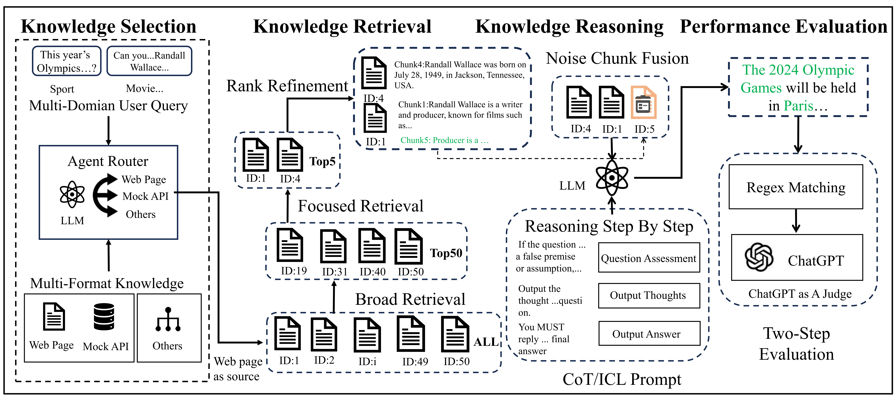

# PruningRAG

This repository is based on the 🥈 [solution](https://github.com/USTCAGI/CRAG-in-KDD-Cup2024) of [Meta KDD Cup '24 CRAG: Comphrensive RAG Benchmark](https://www.aicrowd.com/challenges/meta-comprehensive-rag-benchmark-kdd-cup-2024) !

For more information, visit our official homepage at https://ustc-rag-x.github.io/
You can read our paper at https://arxiv.org/abs/2409.13694.

### 📊 Dataset
In recent years, various datasets have been proposed to challenge and advance RAG, yet most include only a single knowledge source. Real-world applications often involve multiple external knowledge sources, but no suitable benchmark dataset exists for multi-source RAG evaluation. The KDD Cup 2024 CRAG competition dataset, which includes both unstructured web page knowledge and structured mock API data, presents unique challenges. The web page data, in HTML format, contains excessive tags that degrade quality, and the lack of a unified parsing standard complicates evaluation. The mock API, lacking fuzzy matching and consistent entity names, adds further complexity.

To address these issues, we standardized the dataset for RAG evaluation by cleaning the web page data, removing HTML noise, and converting it into a Markdown format compatible with current RAG frameworks. For the mock API, we applied rule-based processing to align entity names with queries and transformed API responses into natural language, improving accessibility for LLM-based reasoning. These improvements enhance dataset usability and establish it as a valuable resource for advancing RAG research.

Our refined version of the dataset, named RM3QA—'A Real-time Multi-domain, Multi-format, Multi-source Question Answer Dataset for RAG'—is now available [here](https://huggingface.co/datasets/fishsure/RM3QA).

## 🏁 Our RAG framework



The PruningRAG framework processes queries and multi-source knowledge to generate accurate, contextually relevant responses through a systematic workflow. It begins with multi-source knowledge pruning to select high-quality, relevant information. In the coarse-grained stage, a fine-tuned large language model (LLM) filters out irrelevant sources, narrowing the search space. The retained knowledge then undergoes fine-grained pruning, using techniques like BM25, dense retrieval, and rule-based API processing to ensure accuracy and contextual relevance.

The pruned knowledge is integrated with the query and passed to the reasoning component, where techniques like Chain-of-Thought (CoT) reasoning, In-Context Learning (ICL), and noise fusion help generate coherent, grounded responses and reduce hallucinations. Finally, the framework evaluates responses using metrics such as accuracy, hallucination rate, and overall performance, combining string matching with GPT-based assessments to ensure reliable knowledge retrieval and minimize misleading information. This integrated process ensures PruningRAG leverages multi-source knowledge and advanced reasoning for high-quality responses.

### Router

We designed two specialized routers: the **Domain Router** and the **Dynamism Router**.

We trained **Sentence Classifiers** as routers for Domain and Dynamism based on **Llama3.1-8B-Instruct**.

Model Weights locate at `models/router`.

### Retriever

#### Web Pages

1. **Broad Retrieval** : Segment text from Web Pages into chunks of **1024** tokens. Use **BM25** to select the top **50** relevant text blocks.
2. **Focused Retrieval**: Segment text blocks into **256**-token chunks, transform them into embeddings using the `bge-m3` model, and select the top 10 relevant chunks based on cosine similarity.
3. **Rank Refinement**: Use `bge-m3-v2-reranker` to re-rank the Top **10** chunks and select the Top **3** segments.

For more detail, refers to `models/retrieve/retriever.py`.

#### Mock APIs

1. **Named Entity Recognition (NER)**: Use Llama3-70B to classify named entities in questions into predefined categories specific to each domain.
2. **Entity Match**: Match extracted entities with API input parameters (e.g., converting company names to ticker symbols for finance APIs).
3. **Time Information Extraction**: Extract temporal information from user inputs and compute relative time based on query time.
4. **API Select**: Use manually designed rules to select relevant APIs for a given question.
5. **Json to Markdown**: Convert JSON output from APIs into Markdown format for better processing by LLMs.

For more detail, refers to `models/mock_api`.

### Generation


#### Adaptive Few-Shot CoT Prompt

```python
"""For the given question and multiple references from Mock API, think step by step, then provide the final answer.
Current date: {query_time}

Note: 
- For your final answer, please use as few words as possible. 
- The user's question may contain factual errors, in which case you MUST reply `invalid question` Here are some examples of invalid questions:
    - `what's the latest score update for OKC's game today?` (There is no game for OKC today)
    - `how many times has curry won the nba dunk contest?` (Steph Curry has never participated in the NBA dunk contest)
- If you don't know the answer, you MUST respond with `I don't know`
- If the references do not contain the necessary information to answer the question, respond with `I don't know`
- Using only the refernces below and not prior knowledge, if there is no reference, respond with `I don't know`
- Your output format needs to meet the requirements: First, start with `## Thought\n` and then output the thought process regarding the user's question. After you finish thinking, you MUST reply with the final answer on the last line, starting with `## Final Answer\n` and using as few words as possible.

### Question
{query}

### References
{references}
"""
```


## Get Started

### Install Dependencies!
```bash
pip install -r requirements.txt
```

### Download Models

`meta-llama/Meta-Llama-3-8B-Instruct`:

+ https://huggingface.co/meta-llama/Meta-Llama-3-8B-Instruct
+ https://www.modelscope.cn/models/LLM-Research/Meta-Llama-3-8B-Instruct

`BAAI/bge-m3`:

+ https://huggingface.co/BAAI/bge-m3
+ https://www.modelscope.cn/models/Xorbits/bge-m3

`BAAI/bge-reranker-v2-m3`:

+ https://huggingface.co/BAAI/bge-reranker-v2-m3
+ https://www.modelscope.cn/models/AI-ModelScope/bge-reranker-v2-m3

### Run LLM

+ Use API server(such as openai)

  + open [`main.py`](main.py)
  + setup your `api_key`and `base_url`
  + choose your `model_name`(default: gpt-4o)

+ Run LLM locally with vLLM server

  + download your llm(such as Llama3-70B)

  + start your server using python

    ```bash
    python -m vllm.entrypoints.openai.api_server \
      --model ./meta-llama/Meta-Llama-3-8B-Instruct \
      --served-model-name Llama3-8B \
      --trust-remote-code
    ```

    refer to https://docs.vllm.ai/en/stable/serving/openai_compatible_server.html for more details

  + open [`main.py`](main.py)

  + choose you `model_name`, such as `Llama3-8B`

  + add parameter `stop` to function `load_model`

    ```python
    load_model(model_name=model_name, api_key=api_key, base_url=base_url, temperature=0, stop=["<|eot_id|>"])
    ```

+ Run LLM locally with Ollama

  + install ollama

    ```bash
    curl -fsSL https://ollama.com/install.sh | sh
    ```

  + pull llm(such as llama3)

    ```
    ollama pull llama3
    ```

  + open [`main.py`](main.py)

  + choose you `model_name`, such as `llama3`

  + use `load_model_ollama`


### Predict

run `main.py`

### Evaluate

run `evaluation.py`

